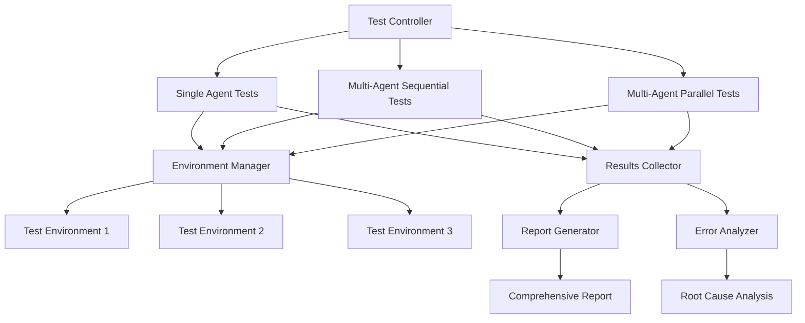

# Design Document

## Overview

This design implements a comprehensive testing system for EquitrCoder that validates all operational modes (single agent, multi-agent sequential, and multi-agent parallel) using the moonshot/kimi-k2-0711-preview model. The system creates isolated testing environments, executes standardized test scenarios, and provides detailed error analysis with root cause identification and automatic fixes where possible.

## Architecture

### High-Level Architecture



### Component Architecture

The system consists of several key components:

1. **ComprehensiveModeTestController**: Main orchestrator that manages all test execution
2. **IsolatedTestEnvironmentManager**: Creates and manages isolated test environments
3. **ModeSpecificTestSuites**: Individual test suites for each mode
4. **ErrorAnalysisEngine**: Analyzes failures and provides root cause analysis
5. **AutoFixEngine**: Attempts automatic fixes for identified issues
6. **ReportGenerator**: Creates comprehensive test reports

## Components and Interfaces

### ComprehensiveModeTestController

```python
class ComprehensiveModeTestController:
    """Main controller for comprehensive mode testing."""
    
    def __init__(self, base_test_dir: str, model: str = "moonshot/kimi-k2-0711-preview"):
        self.base_test_dir = Path(base_test_dir)
        self.model = model
        self.environment_manager = IsolatedTestEnvironmentManager(base_test_dir)
        self.error_analyzer = ErrorAnalysisEngine()
        self.auto_fix_engine = AutoFixEngine()
        self.report_generator = ReportGenerator()
    
    async def run_comprehensive_tests(self) -> ComprehensiveTestResults:
        """Run all test modes and return comprehensive results."""
        
    async def run_single_agent_tests(self) -> SingleAgentTestResults:
        """Run single agent mode tests."""
        
    async def run_multi_agent_sequential_tests(self) -> MultiAgentTestResults:
        """Run multi-agent sequential mode tests."""
        
    async def run_multi_agent_parallel_tests(self) -> MultiAgentTestResults:
        """Run multi-agent parallel mode tests."""
```

### IsolatedTestEnvironmentManager

```python
class IsolatedTestEnvironmentManager:
    """Manages isolated test environments for each mode."""
    
    def create_environment(self, mode: str, test_id: str) -> TestEnvironment:
        """Create isolated test environment."""
        
    def cleanup_environment(self, env_id: str) -> None:
        """Clean up test environment."""
        
    def preserve_artifacts(self, env_id: str, artifacts_dir: str) -> None:
        """Preserve test artifacts for analysis."""
```

### ModeSpecificTestSuites

Each mode has its own test suite that validates core functionalities:

```python
class SingleAgentTestSuite:
    """Test suite for single agent mode."""
    
    async def test_document_creation(self) -> TestResult:
        """Test document creation functionality."""
        
    async def test_todo_completion(self) -> TestResult:
        """Test todo completion functionality."""
        
    async def test_agent_execution(self) -> TestResult:
        """Test agent execution functionality."""
        
    async def test_audit_functionality(self) -> TestResult:
        """Test audit functionality."""

class MultiAgentTestSuite:
    """Test suite for multi-agent modes."""
    
    async def test_document_creation(self) -> TestResult:
        """Test document creation in multi-agent mode."""
        
    async def test_todo_completion(self) -> TestResult:
        """Test todo completion with agent coordination."""
        
    async def test_agent_communication(self) -> TestResult:
        """Test agent communication functionality."""
        
    async def test_parallel_execution(self) -> TestResult:
        """Test parallel execution (parallel mode only)."""
        
    async def test_audit_functionality(self) -> TestResult:
        """Test audit functionality in multi-agent mode."""
```

### ErrorAnalysisEngine

```python
class ErrorAnalysisEngine:
    """Analyzes test failures and provides root cause analysis."""
    
    def analyze_failure(self, test_result: TestResult, context: Dict[str, Any]) -> FailureAnalysis:
        """Analyze a test failure and determine root cause."""
        
    def categorize_error(self, error: Exception, context: Dict[str, Any]) -> ErrorCategory:
        """Categorize the type of error."""
        
    def suggest_fixes(self, failure_analysis: FailureAnalysis) -> List[str]:
        """Suggest potential fixes for the failure."""
```

### AutoFixEngine

```python
class AutoFixEngine:
    """Attempts automatic fixes for identified issues."""
    
    async def attempt_fix(self, failure_analysis: FailureAnalysis) -> FixResult:
        """Attempt to automatically fix the identified issue."""
        
    def can_auto_fix(self, error_category: ErrorCategory) -> bool:
        """Determine if error can be automatically fixed."""
```

## Data Models

### Test Configuration

```python
@dataclass
class ComprehensiveTestConfig:
    model: str = "moonshot/kimi-k2-0711-preview"
    max_cost_per_test: float = 5.0
    max_iterations_per_test: int = 20
    timeout_seconds: int = 300
    test_task: str = "Create a simple calculator application with basic arithmetic operations, CLI interface, input validation, error handling, and unit tests"
    parallel_agents_count: int = 3
    enable_auto_fix: bool = True
    preserve_artifacts: bool = True
```

### Test Results

```python
@dataclass
class TestResult:
    test_name: str
    mode: str
    success: bool
    execution_time: float
    cost: float
    iterations: int
    error_message: Optional[str] = None
    root_cause: Optional[str] = None
    artifacts: List[str] = field(default_factory=list)
    performance_metrics: Optional[PerformanceMetrics] = None

@dataclass
class ComprehensiveTestResults:
    single_agent_results: SingleAgentTestResults
    multi_agent_sequential_results: MultiAgentTestResults
    multi_agent_parallel_results: MultiAgentTestResults
    overall_success: bool
    total_execution_time: float
    total_cost: float
    failure_analysis: List[FailureAnalysis]
    performance_comparison: Dict[str, Any]
    test_timestamp: str
```

### Error Analysis

```python
@dataclass
class FailureAnalysis:
    error_category: ErrorCategory
    root_cause: str
    error_message: str
    stack_trace: str
    suggested_fixes: List[str]
    context: Dict[str, Any]
    auto_fixable: bool = False

class ErrorCategory(Enum):
    CONFIGURATION_ERROR = "configuration_error"
    EXECUTION_ERROR = "execution_error"
    DOCUMENT_CREATION_ERROR = "document_creation_error"
    TODO_SYSTEM_ERROR = "todo_system_error"
    AUDIT_SYSTEM_ERROR = "audit_system_error"
    COORDINATION_ERROR = "coordination_error"
    PARALLEL_EXECUTION_ERROR = "parallel_execution_error"
    MODEL_API_ERROR = "model_api_error"
    UNKNOWN_ERROR = "unknown_error"
```

## Error Handling

### Error Detection Strategy

1. **Proactive Monitoring**: Monitor each test phase for specific error patterns
2. **Context Preservation**: Capture full context when errors occur
3. **Categorization**: Automatically categorize errors by type and severity
4. **Root Cause Analysis**: Analyze error patterns to identify underlying causes

### Error Categories and Handling

1. **Configuration Errors**: Invalid model settings, missing API keys, incorrect paths
   - Auto-fix: Validate and correct configuration parameters
   
2. **Execution Errors**: Agent failures, timeout issues, resource constraints
   - Auto-fix: Retry with adjusted parameters, increase timeouts
   
3. **Document Creation Errors**: Failed requirements/design/todos generation
   - Auto-fix: Retry with simplified prompts, fallback templates
   
4. **Todo System Errors**: Todo parsing failures, completion tracking issues
   - Auto-fix: Repair todo format, reset completion status
   
5. **Audit System Errors**: Audit tool failures, validation issues
   - Auto-fix: Reset audit state, use alternative validation methods
   
6. **Coordination Errors**: Agent communication failures, synchronization issues
   - Auto-fix: Restart coordination, use fallback communication methods
   
7. **Parallel Execution Errors**: Concurrency issues, resource conflicts
   - Auto-fix: Reduce parallelism, implement resource locking

### Auto-Fix Strategies

```python
class AutoFixStrategies:
    """Strategies for automatically fixing common issues."""
    
    async def fix_configuration_error(self, error: ConfigurationError) -> FixResult:
        """Fix configuration-related errors."""
        
    async def fix_model_api_error(self, error: ModelAPIError) -> FixResult:
        """Fix model API-related errors."""
        
    async def fix_document_creation_error(self, error: DocumentCreationError) -> FixResult:
        """Fix document creation errors."""
        
    async def fix_coordination_error(self, error: CoordinationError) -> FixResult:
        """Fix agent coordination errors."""
```

## Testing Strategy

### Test Scenarios

Each mode will be tested with the following scenarios:

1. **Document Creation Test**
   - Verify requirements.md creation
   - Verify design.md creation
   - Verify todos.md creation
   - Validate document content quality

2. **Todo Completion Test**
   - Verify todos are parsed correctly
   - Verify todos are completed systematically
   - Verify completion tracking works
   - Validate final deliverables

3. **Agent Execution Test**
   - Verify agent starts and runs properly
   - Verify agent follows instructions
   - Verify agent produces expected outputs
   - Validate agent resource usage

4. **Audit Functionality Test**
   - Verify audit tools are available
   - Verify audit processes run correctly
   - Verify audit results are captured
   - Validate audit reporting

5. **Agent Communication Test** (Multi-agent modes only)
   - Verify agents can communicate
   - Verify message passing works
   - Verify coordination mechanisms
   - Validate shared state management

6. **Parallel Execution Test** (Parallel mode only)
   - Verify concurrent agent execution
   - Verify resource isolation
   - Verify result aggregation
   - Validate performance benefits

### Test Environment Isolation

Each test runs in a completely isolated environment:

```
testing/comprehensive_mode_tests/
├── run_20250126_143022/
│   ├── single_agent_envs/
│   │   ├── env_001/
│   │   ├── env_002/
│   │   └── env_003/
│   ├── multi_agent_sequential_envs/
│   │   ├── env_001/
│   │   ├── env_002/
│   │   └── env_003/
│   ├── multi_agent_parallel_envs/
│   │   ├── env_001/
│   │   ├── env_002/
│   │   └── env_003/
│   ├── test_results.json
│   └── comprehensive_report.md
```

### Performance Metrics

The system tracks comprehensive performance metrics:

- **Execution Time**: Total time for each test and mode
- **Cost**: API costs for each test and mode
- **Iterations**: Number of agent iterations required
- **Success Rate**: Percentage of successful tests
- **Resource Usage**: Memory and CPU utilization
- **API Calls**: Number and type of API calls made
- **Token Usage**: Total tokens consumed

## Implementation Plan

### Phase 1: Core Infrastructure
1. Implement ComprehensiveModeTestController
2. Implement IsolatedTestEnvironmentManager
3. Create basic test result data models
4. Implement basic error handling

### Phase 2: Test Suites
1. Implement SingleAgentTestSuite
2. Implement MultiAgentTestSuite
3. Create standardized test scenarios
4. Implement performance monitoring

### Phase 3: Error Analysis
1. Implement ErrorAnalysisEngine
2. Create error categorization system
3. Implement root cause analysis
4. Create failure reporting

### Phase 4: Auto-Fix Engine
1. Implement AutoFixEngine
2. Create fix strategies for common errors
3. Implement fix validation
4. Create fix reporting

### Phase 5: Reporting
1. Implement ReportGenerator
2. Create comprehensive report templates
3. Implement performance comparison
4. Create actionable recommendations

### Phase 6: Integration and Validation
1. Integrate all components
2. Run comprehensive validation tests
3. Optimize performance
4. Create documentation