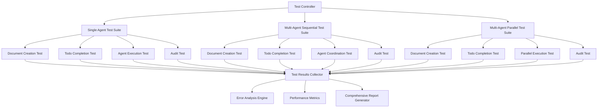

# Design Document

## Overview

This design outlines a comprehensive testing framework for the EquitrCoder system that validates different agent configurations and workflows. The system will create isolated testing environments for single agent, multi-agent without parallelization, and multi-agent with parallelization scenarios, all using the moonshot/kimi-k2-0711-preview model.

## Architecture

### High-Level Architecture



### Testing Framework Components

1. **Test Controller**: Orchestrates all test scenarios and manages isolation
2. **Test Suite Managers**: Handle specific agent configuration testing
3. **Test Environment Manager**: Creates and manages isolated testing folders
4. **Results Collector**: Aggregates results from all test scenarios
5. **Error Analysis Engine**: Performs root cause analysis on failures
6. **Report Generator**: Creates comprehensive test reports

## Components and Interfaces

### Test Controller

**Interface**:
```python
class ComprehensiveTestController:
    async def run_all_tests(self) -> TestResults
    async def run_single_agent_tests(self) -> SingleAgentTestResults
    async def run_multi_agent_sequential_tests(self) -> MultiAgentTestResults
    async def run_multi_agent_parallel_tests(self) -> MultiAgentTestResults
    def generate_comprehensive_report(self, results: TestResults) -> str
```

**Responsibilities**:
- Coordinate execution of all test scenarios
- Manage test isolation and cleanup
- Aggregate results from all test suites
- Generate final comprehensive report

### Test Suite Managers

#### Single Agent Test Suite Manager

**Interface**:
```python
class SingleAgentTestSuite:
    async def test_document_creation(self) -> TestResult
    async def test_todo_completion(self) -> TestResult
    async def test_agent_execution(self) -> TestResult
    async def test_audit_functionality(self) -> TestResult
```

#### Multi-Agent Test Suite Manager

**Interface**:
```python
class MultiAgentTestSuite:
    def __init__(self, parallel_mode: bool = False)
    async def test_document_creation(self) -> TestResult
    async def test_todo_completion(self) -> TestResult
    async def test_agent_coordination(self) -> TestResult
    async def test_audit_functionality(self) -> TestResult
```

### Test Environment Manager

**Interface**:
```python
class TestEnvironmentManager:
    def create_isolated_environment(self, test_name: str) -> Path
    def cleanup_environment(self, env_path: Path) -> None
    def setup_test_configuration(self, env_path: Path, config: TestConfig) -> None
```

**Responsibilities**:
- Create separate testing directories for each scenario
- Set up isolated configurations
- Manage cleanup after tests complete
- Prevent cross-contamination between tests

### Results Collector and Analysis

**Interface**:
```python
class TestResultsCollector:
    def collect_result(self, test_name: str, result: TestResult) -> None
    def get_all_results(self) -> Dict[str, TestResult]
    def analyze_failures(self) -> List[FailureAnalysis]
    def generate_performance_metrics(self) -> PerformanceMetrics
```

## Data Models

### Test Configuration

```python
@dataclass
class TestConfig:
    model: str = "moonshot/kimi-k2-0711-preview"
    max_cost: float = 5.0
    max_iterations: int = 20
    timeout_seconds: int = 300
    test_task: str = "Create a simple calculator application"
    expected_files: List[str] = None
    expected_todos: int = None
```

### Test Result

```python
@dataclass
class TestResult:
    test_name: str
    success: bool
    execution_time: float
    cost: float
    iterations: int
    error_message: Optional[str] = None
    root_cause: Optional[str] = None
    performance_metrics: Dict[str, Any] = None
    artifacts: List[str] = None
```

### Comprehensive Test Results

```python
@dataclass
class ComprehensiveTestResults:
    single_agent_results: SingleAgentTestResults
    multi_agent_sequential_results: MultiAgentTestResults
    multi_agent_parallel_results: MultiAgentTestResults
    overall_success: bool
    total_execution_time: float
    total_cost: float
    failure_analysis: List[FailureAnalysis]
    performance_comparison: Dict[str, Any]
```

## Error Handling

### Error Categories

1. **Configuration Errors**: Model not available, API key issues
2. **Execution Errors**: Agent failures, timeout issues
3. **Document Creation Errors**: Failed to generate required documents
4. **Todo System Errors**: Todo creation or completion failures
5. **Audit System Errors**: Audit execution or validation failures
6. **Coordination Errors**: Multi-agent communication failures
7. **Parallel Execution Errors**: Race conditions, resource conflicts

### Error Analysis Engine

**Interface**:
```python
class ErrorAnalysisEngine:
    def analyze_error(self, error: Exception, context: Dict[str, Any]) -> FailureAnalysis
    def categorize_error(self, error: Exception) -> ErrorCategory
    def suggest_fixes(self, analysis: FailureAnalysis) -> List[str]
    def identify_root_cause(self, error_chain: List[Exception]) -> str
```

**Analysis Process**:
1. Capture full error stack trace and context
2. Categorize error type and severity
3. Identify root cause through error chain analysis
4. Generate specific fix suggestions
5. Track error patterns across test runs

## Testing Strategy

### Test Scenarios

#### Single Agent Tests

1. **Document Creation Test**
   - Verify requirements.md generation
   - Verify design.md generation
   - Verify todos.md generation
   - Validate document content quality

2. **Todo Completion Test**
   - Create todos from generated document
   - Execute agent to complete todos
   - Verify todo status updates
   - Check completion accuracy

3. **Agent Execution Test**
   - Test basic agent functionality
   - Verify tool usage
   - Check cost tracking
   - Validate iteration limits

4. **Audit Test**
   - Trigger audit after completion
   - Verify audit execution
   - Check audit results
   - Validate audit logging

#### Multi-Agent Sequential Tests

1. **Document Creation Test**
   - Test shared document creation
   - Verify agent coordination
   - Check document consistency

2. **Todo Completion Test**
   - Test todo distribution
   - Verify sequential execution
   - Check coordination messages

3. **Agent Coordination Test**
   - Test message passing
   - Verify supervisor functionality
   - Check task distribution

4. **Audit Test**
   - Test multi-agent audit
   - Verify coordination during audit
   - Check comprehensive audit results

#### Multi-Agent Parallel Tests

1. **Document Creation Test**
   - Test concurrent document access
   - Verify no race conditions
   - Check document integrity

2. **Todo Completion Test**
   - Test parallel todo execution
   - Verify no conflicts
   - Check completion synchronization

3. **Parallel Execution Test**
   - Test concurrent agent execution
   - Verify resource management
   - Check performance scaling

4. **Audit Test**
   - Test parallel audit execution
   - Verify audit coordination
   - Check comprehensive results

### Test Data and Scenarios

#### Standard Test Task
```
"Create a simple calculator application with the following features:
1. Basic arithmetic operations (add, subtract, multiply, divide)
2. A command-line interface
3. Input validation
4. Error handling for division by zero
5. Unit tests for all operations"
```

#### Expected Outcomes
- **Documents**: 3 files (requirements.md, design.md, todos.md)
- **Todos**: 8-15 todos covering setup, implementation, testing
- **Files**: Calculator implementation, tests, documentation
- **Audit**: Successful audit with no critical issues

## Implementation Plan

### Phase 1: Core Framework
1. Implement TestController and base classes
2. Create TestEnvironmentManager
3. Set up isolated testing directories
4. Implement basic result collection

### Phase 2: Single Agent Testing
1. Implement SingleAgentTestSuite
2. Create document creation tests
3. Implement todo completion tests
4. Add agent execution tests
5. Implement audit tests

### Phase 3: Multi-Agent Testing
1. Implement MultiAgentTestSuite
2. Add sequential execution tests
3. Implement parallel execution tests
4. Create coordination tests
5. Add multi-agent audit tests

### Phase 4: Analysis and Reporting
1. Implement ErrorAnalysisEngine
2. Create performance metrics collection
3. Implement comprehensive reporting
4. Add root cause analysis
5. Create fix suggestions

### Phase 5: Integration and Validation
1. Integrate all test suites
2. Validate test isolation
3. Test error handling
4. Validate reporting accuracy
5. Performance optimization

## Performance Considerations

### Resource Management
- Limit concurrent test execution to prevent resource exhaustion
- Implement proper cleanup to prevent disk space issues
- Monitor memory usage during parallel tests
- Set appropriate timeouts for all operations

### Cost Management
- Set cost limits for each test scenario
- Track and report cost per test
- Implement cost-based test termination
- Optimize test tasks to minimize API costs

### Execution Time
- Implement parallel test execution where safe
- Set reasonable timeouts for all operations
- Optimize test task complexity
- Provide progress reporting for long-running tests

## Security Considerations

### Test Isolation
- Ensure complete isolation between test environments
- Prevent test data leakage between scenarios
- Secure cleanup of sensitive test data
- Validate file system boundaries

### API Security
- Secure handling of API keys in test environments
- Prevent API key exposure in logs or reports
- Implement rate limiting to prevent API abuse
- Validate model access permissions

## Monitoring and Observability

### Logging Strategy
- Comprehensive logging for all test operations
- Structured logging for easy analysis
- Separate log files for each test scenario
- Error-specific logging with full context

### Metrics Collection
- Execution time metrics for all operations
- Cost tracking per test and overall
- Success/failure rates by test type
- Performance comparison metrics

### Reporting
- Real-time progress reporting
- Detailed failure analysis reports
- Performance comparison reports
- Trend analysis across test runs