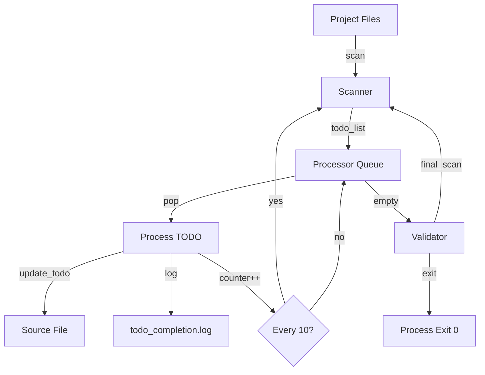

# design.md

## 1. System Architecture

The TODO completion system is a single-process, file-based automation tool that operates in three phases:

```
┌─────────────────┐     ┌──────────────────┐     ┌─────────────────┐
│   Discovery     │────▶│   Processing     │────▶│   Termination   │
│   (Scanner)     │     │   (Executor)     │     │   (Validator)   │
└─────────────────┘     └──────────────────┘     └─────────────────┘
```

- **Discovery**: Recursively scans project files for TODO patterns
- **Processing**: Works through TODOs sequentially, updating each via `update_todo`
- **Termination**: Validates zero TODOs remain and exits cleanly

## 2. Components

### 2.1 Scanner Module (`scanner.py`)
- **Purpose**: Discover all TODO items in the project
- **Responsibilities**:
  - Recursively traverse directory tree
  - Match against TODO patterns: `TODO`, `FIXME`, `HACK`, `@todo`
  - Generate unique IDs: `<relative-path>:<line-number>`
  - Return sorted list of TODO objects

### 2.2 Processor Module (`processor.py`)
- **Purpose**: Execute TODO completion workflow
- **Responsibilities**:
  - Maintain in-memory queue of open TODOs
  - Process one TODO at a time
  - Invoke `update_todo` tool after completion
  - Log completion events to `todo_completion.log`
  - Trigger re-scan every 10 completions

### 2.3 Validator Module (`validator.py`)
- **Purpose**: Ensure system integrity
- **Responsibilities**:
  - Verify no duplicate TODO IDs in log
  - Confirm final scan shows zero TODOs
  - Validate exit conditions

### 2.4 CLI Interface (`main.py`)
- **Purpose**: Entry point and orchestration
- **Responsibilities**:
  - Coordinate scanner → processor → validator flow
  - Handle command-line arguments
  - Manage process lifecycle

## 3. Data Flow



### 3.1 TODO Object Structure
```python
{
    "id": "src/main.py:42",
    "file": "src/main.py",
    "line": 42,
    "content": "TODO: Refactor this function",
    "type": "TODO",
    "status": "open"
}
```

### 3.2 Log Entry Format
```
2024-01-15T14:30:22Z - src/utils.py:15 - completed
```

## 4. Implementation Plan

### Phase 1: Foundation (Day 1)
1. Create project structure
2. Implement basic file scanner
3. Add TODO pattern matching
4. Write unit tests for scanner

### Phase 2: Core Logic (Day 2)
1. Implement processor queue
2. Add update_todo integration
3. Create logging mechanism
4. Add re-scan trigger logic

### Phase 3: Validation (Day 3)
1. Implement validator module
2. Add duplicate detection
3. Create final scan verification
4. Write integration tests

### Phase 4: Polish (Day 4)
1. Add progress reporting
2. Handle edge cases (obsolete TODOs)
3. Performance optimization
4. Documentation

## 5. File Structure

```
todo-completer/
├── src/
│   ├── main.py              # CLI entry point
│   ├── scanner.py           # TODO discovery
│   ├── processor.py         # Sequential processing
│   ├── validator.py         # Final verification
│   └── utils.py             # Shared utilities
├── tests/
│   ├── test_scanner.py
│   ├── test_processor.py
│   ├── test_validator.py
│   └── fixtures/            # Test project samples
├── todo_completion.log      # Generated log file
├── requirements.txt         # Python dependencies
├── setup.py                # Package installation
└── README.md               # Usage instructions
```

### 5.1 Key Implementation Details

**Scanner.py**:
```python
class Scanner:
    PATTERNS = [
        r'TODO[:\s]*(.*)',
        r'FIXME[:\s]*(.*)',
        r'HACK[:\s]*(.*)',
        r'@todo[:\s]*(.*)'
    ]
    
    def scan(self, root_path: str) -> List[TODO]:
        # Implementation details...
```

**Processor.py**:
```python
class Processor:
    def __init__(self, rescan_interval: int = 10):
        self.rescan_interval = rescan_interval
        self.completed_count = 0
        
    def process_next(self, todo: TODO) -> bool:
        # Process single TODO
        # Call update_todo
        # Log completion
        # Check rescan trigger
```

**update_todo tool**:
```bash
#!/bin/bash
# update_todo.sh
# Usage: ./update_todo.sh <id> completed
```

### 5.2 Configuration

Create `.todocompleter.yml` for project-specific settings:
```yaml
scan_patterns:
  - "**/*.py"
  - "**/*.js"
  - "**/*.md"
  - "**/*.txt"
exclude_dirs:
  - ".git"
  - "node_modules"
  - "__pycache__"
rescan_interval: 10
```

This design provides a robust, deterministic system for systematically completing all TODO items while maintaining clear audit trails and handling edge cases appropriately.