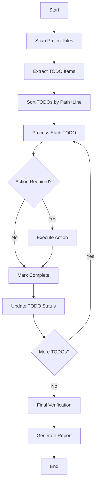

# design.md

## 1. System Architecture

The TODO processing system follows a pipeline architecture with four main stages:

```
┌─────────────────┐    ┌──────────────────┐    ┌─────────────────┐    ┌─────────────────┐
│   Discovery     │───▶│   Prioritization │───▶│   Processing    │───▶│   Verification  │
│   Engine        │    │   Engine         │    │   Engine        │    │   Engine        │
└─────────────────┘    └──────────────────┘    └─────────────────┘    └─────────────────┘
         │                       │                       │                       │
         ▼                       ▼                       ▼                       ▼
┌─────────────────┐    ┌──────────────────┐    ┌─────────────────┐    ┌─────────────────┐
│   File Scanner  │    │   Sorting       │    │   Action       │    │   Report       │
│   & Parser      │    │   Algorithm     │    │   Executor     │    │   Generator    │
└─────────────────┘    └──────────────────┘    └─────────────────┘    └─────────────────┘
```

## 2. Components

### 2.1 Discovery Engine
- **FileScanner**: Recursively scans project directory for supported file types
- **TodoParser**: Extracts TODO items using regex patterns
- **TodoExtractor**: Combines scanner and parser to produce TODO objects

### 2.2 Prioritization Engine
- **Sorter**: Implements deterministic sorting (alphabetical by path, then line number)
- **QueueManager**: Maintains ordered queue of TODO items

### 2.3 Processing Engine
- **ActionExecutor**: Reads TODO description and performs required action
- **CompletionTracker**: Uses `update_todo` tool to mark items complete
- **ErrorHandler**: Logs failures and continues processing

### 2.4 Verification Engine
- **FinalScanner**: Re-scans project to verify zero TODOs remain
- **ReportGenerator**: Creates summary of all completed TODOs

## 3. Data Flow



### 3.1 TODO Object Structure
```python
class TodoItem:
    file_path: str
    line_number: int
    content: str
    type: str  # 'comment', 'checkbox', etc.
    description: str
    status: 'pending' | 'completed' | 'failed'
```

## 4. Implementation Plan

### Phase 1: Core Infrastructure (Step 1-3)
1. **Create Discovery Engine**
   - Implement file scanner with glob patterns
   - Build regex-based TODO parsers for each file type
   - Create TodoItem data structure

2. **Implement Prioritization**
   - Add sorting algorithm (path ASC, line ASC)
   - Build queue management system

3. **Build Processing Loop**
   - Create main orchestrator class
   - Implement sequential processing logic

### Phase 2: Action Execution (Step 4-6)
4. **Action Parser**
   - Parse TODO descriptions into actionable commands
   - Map common patterns to specific actions

5. **Action Implementations**
   - Create handlers for common TODO types:
     - Code refactoring
     - Documentation updates
     - Configuration changes
     - Test additions

6. **Integration with update_todo**
   - Implement tool call wrapper
   - Add retry logic for failed updates

### Phase 3: Verification & Reporting (Step 7-8)
7. **Final Verification**
   - Re-run discovery after processing
   - Ensure zero TODOs remain

8. **Report Generation**
   - Create markdown summary
   - Include completion statistics

### Phase 4: Testing & Polish (Step 9-10)
9. **Error Handling**
   - Add comprehensive logging
   - Implement graceful degradation

10. **Final Integration**
    - Test end-to-end flow
    - Add progress indicators

## 5. File Structure

```
todo-processor/
├── src/
│   ├── __init__.py
│   ├── main.py                 # Entry point
│   ├── discovery/
│   │   ├── __init__.py
│   │   ├── file_scanner.py     # File system traversal
│   │   ├── todo_parser.py      # Regex-based extraction
│   │   └── todo_extractor.py   # Combines scanner+parser
│   ├── models/
│   │   ├── __init__.py
│   │   └── todo_item.py        # TodoItem dataclass
│   ├── processing/
│   │   ├── __init__.py
│   │   ├── sorter.py           # Deterministic sorting
│   │   ├── action_executor.py  # TODO action handlers
│   │   └── processor.py        # Main processing loop
│   ├── verification/
│   │   ├── __init__.py
│   │   ├── final_scanner.py    # Post-processing verification
│   │   └── report_generator.py # Summary report creation
│   └── utils/
│       ├── __init__.py
│       ├── logger.py           # Centralized logging
│       └── tool_wrapper.py     # update_todo integration
├── tests/
│   ├── __init__.py
│   ├── test_discovery.py
│   ├── test_processing.py
│   └── fixtures/
│       ├── sample.py
│       └── sample.md
├── logs/
│   └── processing.log
├── reports/
│   └── completion_report.md
├── requirements.txt
└── README.md
```

### 5.1 Key Files Description

- **main.py**: Orchestrates the entire pipeline
- **todo_parser.py**: Contains regex patterns for each file type:
  ```python
  PATTERNS = {
      'python': r'# TODO[:\s-]+(.+)$',
      'javascript': r'// TODO[:\s-]+(.+)$',
      'typescript': r'// TODO[:\s-]+(.+)$',
      'markdown': r'<!-- TODO[:\s-]+(.+) -->|\[ \] (.+)$',
      'yaml': r'# TODO[:\s-]+(.+)$',
      'json': r'// TODO[:\s-]+(.+)$'
  }
  ```
- **action_executor.py**: Maps TODO descriptions to specific actions
- **report_generator.py**: Creates final markdown report with:
  - Total TODOs processed
  - Success/failure counts
  - Detailed list of completed items
  - Any failures with error messages