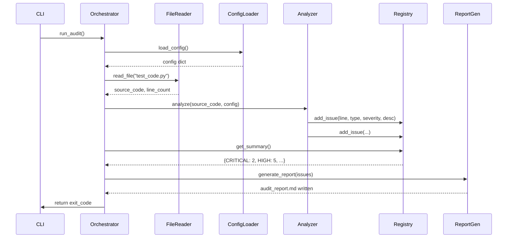

# design.md

## 1. System Architecture

```
┌─────────────────────────────────────────────────────────────┐
│                     Static Analysis Tool                    │
│                                                             │
│  ┌─────────────┐    ┌──────────────────┐    ┌──────────┐  │
│  │   CLI       │───▶│   Orchestrator   │───▶│  Exit    │  │
│  │ Interface   │    │   (main.py)      │    │  Codes   │  │
│  └─────────────┘    └──────────────────┘    └──────────┘  │
│           │                    │                            │
│           │                    │                            │
│           │         ┌──────────────────┐                    │
│           │         │   Report         │                    │
│           │         │   Generator      │                    │
│           │         │   (report.py)    │                    │
│           │         └──────────────────┴────────┐           │
│           │                                     │           │
│  ┌─────────────┐    ┌──────────────────┐    ┌──────────┐  │
│  │   Config    │───▶│   Analyzer       │◀───│  File    │  │
│  │   Loader    │    │   Engine         │    │  Reader  │  │
│  │ (config.py) │    │ (analyzer.py)    │    │(reader.py)│  │
│  └─────────────┘    └──────────────────┘    └──────────┘  │
│                                │                            │
│                       ┌──────────────────┐                  │
│                       │   Issue          │                  │
│                       │   Registry       │                  │
│                       │ (registry.py)    │                  │
│                       └──────────────────┘                  │
└─────────────────────────────────────────────────────────────┘
```

## 2. Components

### 2.1 CLI Interface (`cli.py`)
- **Purpose**: Handle command-line arguments and flags
- **Responsibilities**:
  - Parse `--debug` flag
  - Validate file existence
  - Print summary to stdout
  - Return appropriate exit codes

### 2.2 File Reader (`reader.py`)
- **Purpose**: Safely read and validate the target file
- **Responsibilities**:
  - Open `test_code.py` with UTF-8 encoding
  - Handle file not found errors
  - Return raw source code and line count

### 2.3 Config Loader (`config.py`)
- **Purpose**: Load and validate optional configuration
- **Responsibilities**:
  - Read `audit_config.json` if present
  - Provide default configuration
  - Validate configuration schema

### 2.4 Analyzer Engine (`analyzer.py`)
- **Purpose**: Perform static analysis using multiple strategies
- **Sub-components**:
  - **AST Analyzer** (`ast_analyzer.py`): Parse AST for syntax/semantic issues
  - **Style Checker** (`style_checker.py`): Run flake8 via subprocess
  - **Security Scanner** (`security_scanner.py`): Detect anti-patterns
  - **Complexity Analyzer** (`complexity_analyzer.py`): Calculate cyclomatic complexity

### 2.5 Issue Registry (`registry.py`)
- **Purpose**: Central storage for all findings
- **Responsibilities**:
  - Store issues with metadata (line, severity, type, description)
  - Provide aggregation methods (count by severity)
  - Ensure no duplicate issues

### 2.6 Report Generator (`report.py`)
- **Purpose**: Create human-readable markdown report
- **Responsibilities**:
  - Generate executive summary
  - Format detailed findings
  - Write to `audit_report.md`

### 2.7 Orchestrator (`main.py`)
- **Purpose**: Coordinate all components
- **Responsibilities**:
  - Initialize components
  - Control execution flow
  - Handle errors gracefully

## 3. Data Flow



## 4. Implementation Plan

### Phase 1: Foundation (Day 1)
1. Create project structure
2. Implement FileReader with error handling
3. Create basic CLI interface
4. Set up logging infrastructure

### Phase 2: AST Analysis (Day 2)
1. Implement AST Analyzer for:
   - Syntax errors
   - Undefined variables
   - Unused imports/variables
   - Missing docstrings
2. Create Issue Registry
3. Add severity classification

### Phase 3: Style & Security (Day 3)
1. Integrate flake8 via subprocess
2. Implement Security Scanner for:
   - eval/exec usage
   - hard-coded secrets
   - unsafe imports
3. Add configuration support

### Phase 4: Complexity Analysis (Day 4)
1. Implement cyclomatic complexity calculator
2. Add threshold configuration
3. Optimize performance

### Phase 5: Reporting (Day 5)
1. Create Report Generator
2. Format markdown output
3. Add executive summary
4. Test with various file sizes

### Phase 6: Testing & Polish (Day 6-7)
1. Create test suite
2. Performance benchmarking
3. Cross-platform testing
4. Documentation

## 5. File Structure

```
static-audit-tool/
├── src/
│   ├── __init__.py
│   ├── main.py              # Entry point and orchestrator
│   ├── cli.py               # Command-line interface
│   ├── reader.py            # File reading utilities
│   ├── config.py            # Configuration handling
│   ├── registry.py          # Issue storage and management
│   ├── report.py            # Report generation
│   └── analyzers/
│       ├── __init__.py
│       ├── base.py          # Base analyzer class
│       ├── ast_analyzer.py  # AST-based analysis
│       ├── style_checker.py # PEP 8 checking via flake8
│       ├── security_scanner.py # Security pattern detection
│       └── complexity_analyzer.py # Cyclomatic complexity
├── tests/
│   ├── __init__.py
│   ├── fixtures/
│   │   ├── clean_file.py
│   │   ├── syntax_error.py
│   │   ├── security_issues.py
│   │   └── complex_file.py
│   ├── test_reader.py
│   ├── test_analyzers.py
│   └── test_report.py
├── audit_config.json        # Optional configuration
├── requirements.txt         # Development dependencies
├── setup.py                # Package setup
├── README.md               # Usage documentation
└── audit.log               # Debug log (created at runtime)
```

### Key Files Description

**src/main.py**
```python
def run_audit(file_path: str, debug: bool = False) -> int:
    """Main orchestration function"""
    # Initialize components
    # Run analysis
    # Generate report
    # Return exit code
```

**src/analyzers/ast_analyzer.py**
```python
class ASTAnalyzer(BaseAnalyzer):
    def analyze(self, source_code: str) -> List[Issue]:
        """Parse AST and detect issues"""
        # Use ast.parse()
        # Walk tree with ast.NodeVisitor
        # Collect issues
```

**src/report.py**
```python
class ReportGenerator:
    def generate(self, issues: List[Issue], output_path: str):
        """Create markdown report"""
        # Generate summary
        # Format findings
        # Write to file
```

### Configuration Schema (audit_config.json)
```json
{
  "checks": {
    "syntax": true,
    "undefined_vars": true,
    "unused_imports": true,
    "pep8": true,
    "security": true,
    "complexity": {
      "enabled": true,
      "threshold": 10
    },
    "docstrings": true
  },
  "severities": {
    "syntax_error": "CRITICAL",
    "undefined_var": "HIGH",
    "unused_import": "LOW",
    "complexity": "MEDIUM"
  }
}
```