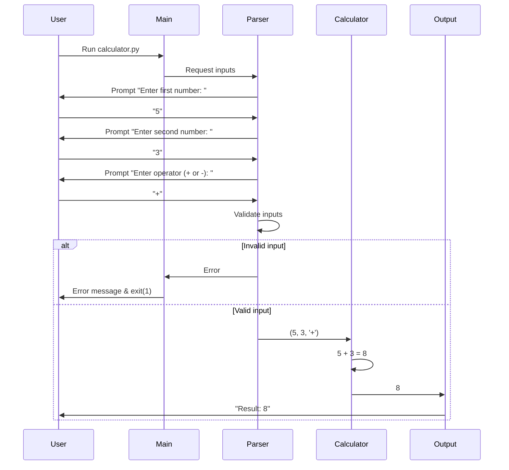

# design.md

## 1. System Architecture

The calculator is a **single-process, single-threaded command-line application** with a linear execution flow:

```
┌─────────────────┐
│   User Input    │
│  (stdin)        │
└────────┬────────┘
         │
┌────────┴────────┐
│  Input Parser   │
│  & Validator    │
└────────┬────────┘
         │
┌────────┴────────┐
│   Calculator    │
│   Engine        │
└────────┬────────┘
         │
┌────────┴────────┐
│   Output        │
│   Formatter     │
└────────┬────────┘
         │
┌────────┴────────┐
│   stdout        │
└─────────────────┘
```

## 2. Components

### 2.1 Input Parser (`parse_input()`)
- **Purpose**: Extract and validate user inputs
- **Responsibilities**:
  - Read two numbers from stdin
  - Read operator from stdin
  - Convert strings to appropriate types
  - Validate format and ranges

### 2.2 Calculator Engine (`calculate()`)
- **Purpose**: Perform mathematical operations
- **Responsibilities**:
  - Execute addition operation
  - Execute subtraction operation
  - Return precise result

### 2.3 Error Handler (`handle_error()`)
- **Purpose**: Centralized error handling
- **Responsibilities**:
  - Format error messages
  - Exit with appropriate codes
  - Ensure clean termination

### 2.4 Main Controller (`main()`)
- **Purpose**: Orchestrate the flow
- **Responsibilities**:
  - Call components in sequence
  - Manage program lifecycle

## 3. Data Flow



## 4. Implementation Plan

### Phase 1: Core Structure (15 min)
1. Create `calculator.py` file
2. Implement `main()` function with basic flow
3. Add shebang line: `#!/usr/bin/env python3`

### Phase 2: Input Handling (20 min)
1. Implement `get_number_input(prompt)` function
   - Use `input()` with custom prompt
   - Wrap `float()` conversion in try-except
   - Return parsed float or raise ValueError
2. Implement `get_operator_input(prompt)` function
   - Accept '+' or '-' (case-insensitive)
   - Return normalized operator or raise ValueError

### Phase 3: Calculation Logic (10 min)
1. Implement `calculate(num1, num2, operator)` function
   - Use dictionary dispatch pattern:
     ```python
     operations = {
         '+': lambda x, y: x + y,
         '-': lambda x, y: x - y
     }
     ```

### Phase 4: Error Handling (10 min)
1. Create centralized error handler
2. Map error types to messages:
   - `ValueError` → "Invalid number format"
   - `InvalidOperatorError` → "Invalid operator. Use + or -"
3. Ensure `sys.exit(1)` on errors

### Phase 5: Integration & Testing (15 min)
1. Wire all components in `main()`
2. Test happy path scenarios
3. Test error scenarios
4. Add docstrings

## 5. File Structure

```
calculator/
├── calculator.py          # Main application file
├── README.md             # Usage instructions
└── tests/
    ├── test_calculator.py  # Unit tests (optional)
    └── test_cases.txt     # Manual test cases
```

### calculator.py Structure
```python
#!/usr/bin/env python3
"""
Simple command-line calculator for addition and subtraction.

Usage:
    $ python calculator.py
    Enter first number: 5
    Enter second number: 3
    Enter operator (+ or -): +
    Result: 8
"""

import sys

class InvalidOperatorError(Exception):
    """Raised when an invalid operator is provided."""
    pass

def get_number_input(prompt: str) -> float:
    """Get and validate numeric input from user."""
    pass

def get_operator_input(prompt: str) -> str:
    """Get and validate operator input from user."""
    pass

def calculate(num1: float, num2: float, operator: str) -> float:
    """Perform calculation based on operator."""
    pass

def handle_error(message: str) -> None:
    """Handle errors by printing message and exiting."""
    pass

def main() -> None:
    """Main application entry point."""
    pass

if __name__ == "__main__":
    main()
```

### Key Design Decisions
1. **No external dependencies**: Uses only Python standard library
2. **Float precision**: Leverages Python's native float handling
3. **Single file**: Meets requirement for minimal structure
4. **Exit codes**: 0 for success, 1 for any error
5. **Case-insensitive operators**: Accepts both '+' and '+'
6. **Clean separation**: Each function has single responsibility